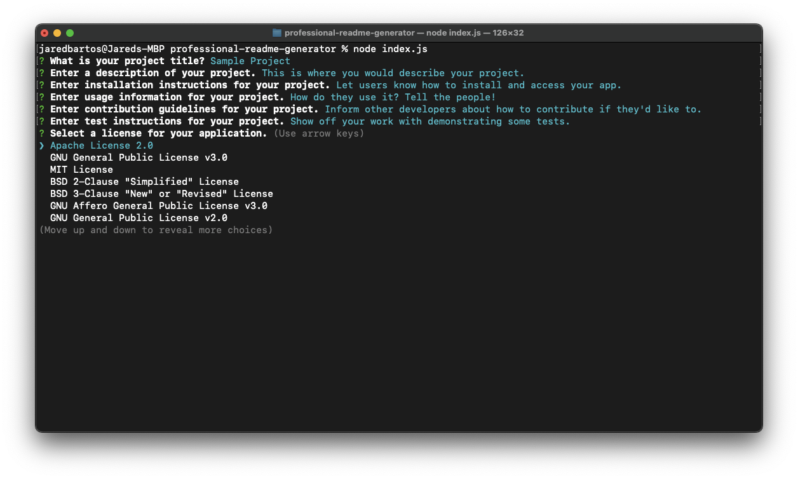
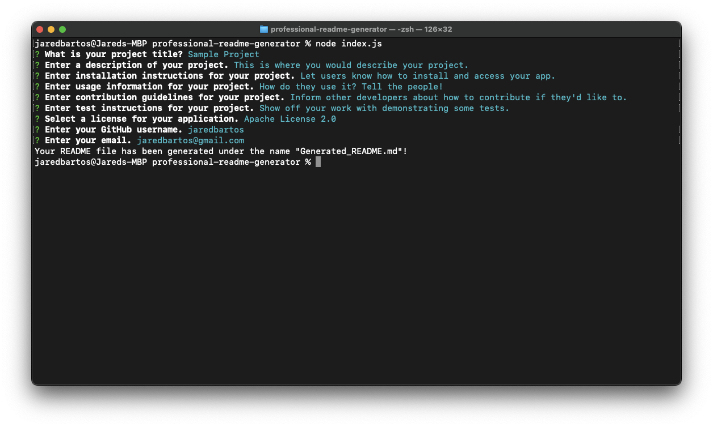
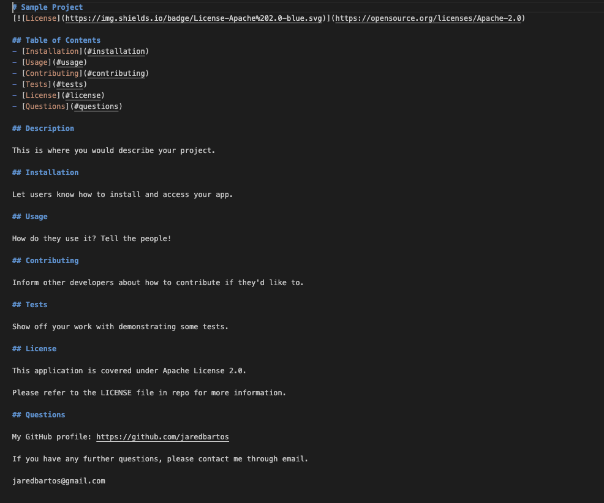
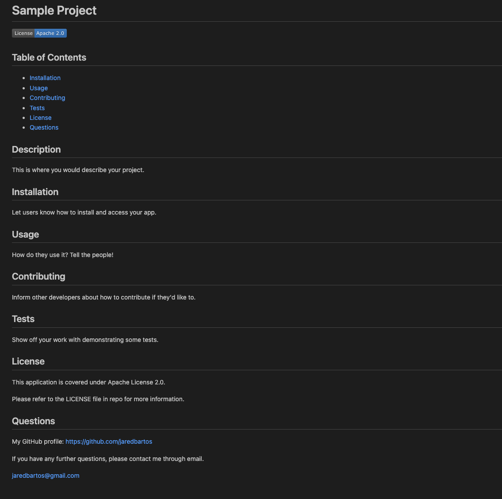

# Professional README Generator

## Description

This application is a professional README generator to give developers the ability to quickly create polished README.md files for their projects, so they can spend more time working on their apps.

## Table of Contents
- [Installation](#installation)
- [Requirements](#requirements)
- [Usage](#usage)
- [License](#license)
- [Questions](#questions)
- [Link to Demonstration Video](#link-to-demonstration-video)
- [Screenshots](#screenshots)

## Installation

To install the application, download the zip file from the GitHub repo, or clone the repo into your chosen directory.

## Requirements

[Node.js](https://nodejs.org/en)

## Usage

To use the Professional README Generator, open your terminal and navigate to the directory where the downloaded folder resides.

Enter the following command to install required node modules:

<code>npm i</code>

Then enter:

<code>node index.js</code> 

Answer the prompts to generate your README file.

Your README will be created under the name "Generated_README.md" in the same directory as the index.js file.

It can then be edited and renamed to your discretion.

## License

This application is covered under MIT License.

Please refer to the LICENSE file in repo for more information.

## Questions

My GitHub profile: https://github.com/jaredbartos

If you have any further questions, please contact me through email.

jaredbartos@gmail.com

## Link to Demonstration Video

https://drive.google.com/file/d/1c7_fiJTBhcVYvWqiDqr2n8ex2G76BJHA/view?usp=sharing

## Screenshots

